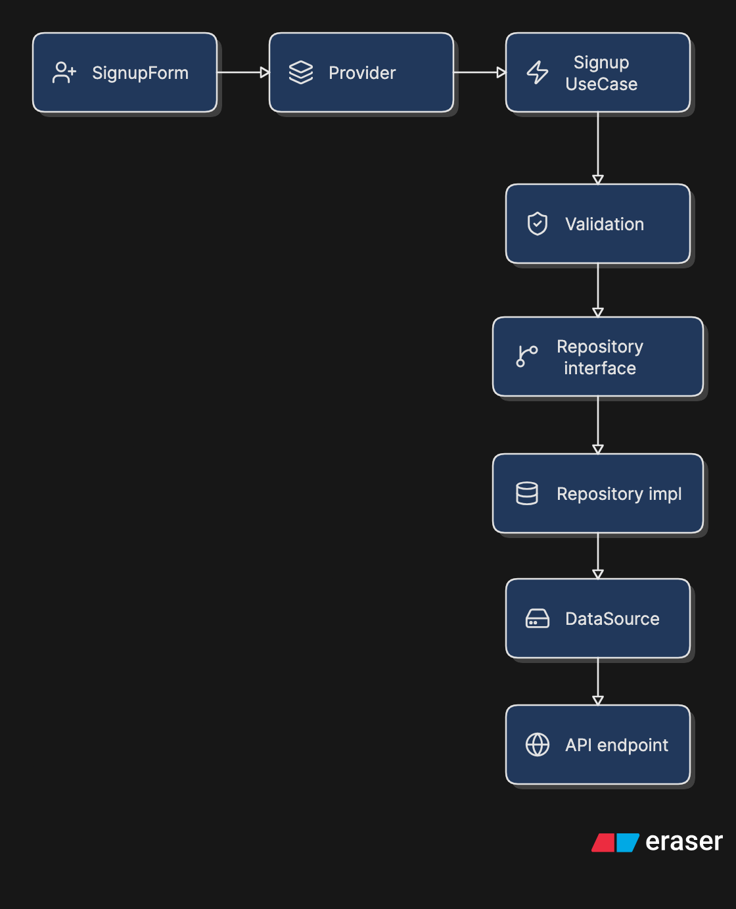

# Signup Clean Architecture Demo

This project contains a small signup feature inspired by Clean Architecture.
It keeps the code simple for learning and avoids exposing private app patterns.

## Big Idea

Each layer has one job:

```text
Presentation -> Domain -> Data -> API
```

The UI does not know how the API works.
The API code does not know about widgets.
The domain layer keeps the signup rule in the middle.

## Folder Shape

```text
lib/
├── core/
│   └── data/
│       └── urls.dart
└── features/
    └── signup/
        ├── presentation/
        │   ├── screens/
        │   ├── widgets/
        │   └── providers/
        ├── domain/
        │   ├── model/
        │   ├── repositories/
        │   ├── usecases/
        │   └── validation/
        ├── data/
        │   └── model/
        └── shared/
```

## Presentation Layer

Presentation is the UI layer.
It contains screens, widgets, provider state, loading, errors, and button actions.

Files:

```text
signup_screen.dart
signup_form.dart
signup_provider.dart
signup_state.dart
```

Communication:

```text
User taps button
      |
      v
SignupForm creates SignupParams
      |
      v
SignupProvider calls SignupUseCase
```

## Domain Layer

Domain is the business layer.
It does not know about Flutter, Dio, JSON, or screens.

Files:

```text
signup_params.dart
signup_repository.dart
signup_usecase.dart
signup_validation.dart
```

The use case decides the rule:

```text
Validate input first
Then call repository
```

Communication:

```text
SignupProvider
      |
      v
SignupUseCase
      |
      v
SignupRepository abstract contract
```

## Data Layer

Data is the API layer.
It prepares request data, calls the endpoint, reads JSON, and returns success or an error message.

Files:

```text
signup_request_model.dart
signup_response_model.dart
signup_data_source.dart
signup_repository_impl.dart
```

Communication:

```text
SignupRepositoryImpl
      |
      v
SignupDataSource
      |
      v
Dio request
      |
      v
/auth/signup
```

## Shared Signup Files

These are tiny helper files used by this feature.

Files:

```text
usecase.dart
ui_state.dart
```

They are simple on purpose:

```text
UseCase       -> base class for actions
UIState       -> idle, loading, success, error
```

## Core

Core only contains a fake public demo URL file:

```text
core/data/urls.dart
```

No network client or private shared error system is included.

## Full Flow Diagram


## Dependency Direction

Clean Architecture inspired rule:

```text
Presentation depends on Domain
Data depends on Domain
Domain depends on no app-specific outer layer
```

In simple words:

```text
Outer layers call inner layers.
Inner layers do not import outer layers.
```

## Test

The use case can be tested without UI and without a real API:

```bash
flutter test test/signup/domain/usecases/signup_usecase_test.dart
```
